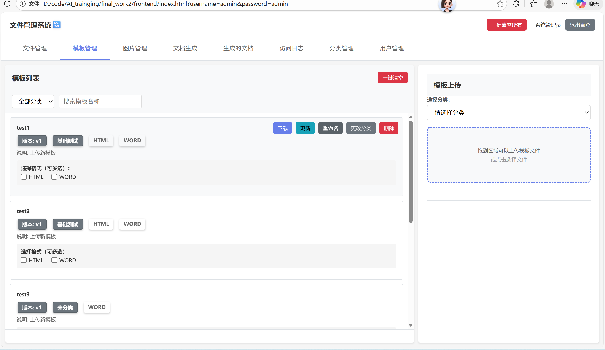

# 文件管理系统 (DMS)

基于 FastAPI、MinIO 和 MySQL 构建的全功能文档管理与生成系统。

## 核心功能

- **文档生成**：支持从 Word/HTML 模板使用 JSON/CSV 数据生成 Word、PDF 和 HTML 文档。
- **模板管理**：多格式模板支持，具备版本管理与一键回退功能。
- **安全与合规**：
  - **数据脱敏**：自动识别并脱敏敏感信息（身份证、手机号、邮箱、银行卡）。
  - **水印功能**：支持 Word、PDF、HTML 的文字和图片水印。
  - **加密保护**：支持 PDF 密码加密和 Word 限制编辑。
  - **权限控制**：基于黑名单的下载与删除权限管理。
- **文件管理**：MinIO 桶存储结合 MySQL 元数据管理，支持分类搜索。
- **审计日志**：完整记录所有文件访问和系统操作。

## 技术栈

- **后端**: FastAPI (Python 3.10+)
- **数据库**: MySQL 5.7+
- **对象存储**: MinIO
- **文档处理**:
  - `python-docx`: Word 生成与保护
  - `jinja2`: 模板引擎
  - `weasyprint`: HTML 转 PDF
  - `matplotlib`: 动态图表生成
- **前端**: 原生 JavaScript, CSS3, HTML5

### 系统预览

#### 1. 模板管理


#### 2. 生成的文档列表


#### 3. MinIO 后台管理


## 快速开始

### 前置要求

- Docker 和 Docker Compose
- Python 3.10+

### 基础设施设置

```bash
# 使用 Docker 启动 MySQL 和 MinIO
docker-compose up -d
```

### 一键初始化与数据导入

系统提供了一键初始化脚本，可自动创建数据库表、管理员账号并导入示例数据：

```bash
cd backend
# 确保已安装依赖
pip install -r requirements.txt
# 运行初始化脚本
python scripts/system_bootstrap.py
```

*默认管理员账号：`admin`，密码：`admin`*

### 数据导出（备份示例）

如果您修改了系统中的模板或数据，并希望将其保存到 `@testdata` 文件夹中作为新的示例包：

```bash
cd backend
python scripts/export_data.py
```

### 启动后端

```bash
cd backend
python -m uvicorn main:app --reload --host 0.0.0.0 --port 8000
```

### 访问前端

在浏览器中打开 `frontend/index.html`。

## 文档

### 中文文档
- [系统架构](docs/ARCHITECTURE_CN.md)
- [功能指南](docs/FUNCTIONALITY_CN.md)
- [模板格式说明](docs/模板格式说明.md)
- [部署指南](docs/DEPLOYMENT_CN.md)
- [系统快照](docs/SYSTEM_SNAPSHOT_CN.md)
- [项目报告](docs/REPORT_OVERVIEW_CN.md)
- [需求对比](docs/REQUIREMENT_COMPARISON.md)
- [推荐模板说明](docs/推荐模板说明.md)

### English Documentation
- [Architecture Overview](docs/ARCHITECTURE.md)
- [Functionality Guide](docs/FUNCTIONALITY.md)
- [Deployment Guide](docs/DEPLOYMENT.md)
- [System Snapshot](docs/SYSTEM_SNAPSHOT.md)
- [Project Report](docs/REPORT_OVERVIEW.md)
- [Requirement Comparison](docs/REQUIREMENT_COMPARISON.md)

## 功能实现状态

### ✅ 已完全实现
- 模板管理（上传、分类、检索）
- 文档生成（Word/PDF/HTML，支持 Jinja2 占位符）
- **数据脱敏**（✅ 已实现 - 自动识别身份证、手机、邮箱、银行卡、姓名等）
- **水印功能**（✅ 已实现 - Word/PDF/HTML 均支持文字和图片水印）
- 文档加密（PDF 密码、Word 只读保护）
- 访问控制（黑名单权限管理）
- 对象存储（MinIO 集成）
- 元数据管理（MySQL 存储和查询）
- 访问日志（完整的审计跟踪）

### 🚧 部分实现
- **版本控制**: 后端 MinIO 存储和 MySQL 元数据已支持版本历史，但前端 UI 界面尚未完成

### 📋 架构说明
- **元数据处理与实际文本处理分离**: 
  - MySQL 存储元数据（快速查询）
  - MinIO 存储实际文件内容（支持大文件）
  - 这种分离设计提高了查询效率和存储可扩展性

---

# Document Management System (DMS)

A comprehensive document management and generation system built with FastAPI, MinIO, and MySQL.

## Key Features

- **Document Generation**: Generate Word, PDF, and HTML documents from templates (Jinja2) using JSON/CSV data.
- **Template Management**: Multi-format template support (Word, HTML, PDF) with versioning and rollback.
- **Security & Compliance**:
  - **Data Masking**: Automatic detection and masking of PII (ID cards, phones, emails, bank cards).
  - **Watermarking**: Text and image watermarks for Word, PDF, and HTML.
  - **Document Encryption**: PDF password protection and Word editing restrictions.
  - **Access Control**: Blacklist-based download and delete permissions for users/departments.
- **File Management**: Categorized storage in MinIO with metadata in MySQL.
- **Audit Logging**: Comprehensive logging of all file access and system actions.

## Technology Stack

- **Backend**: FastAPI (Python 3.10+)
- **Database**: MySQL 5.7+ (Metadata storage)
- **Object Storage**: MinIO (File storage)
- **Document Processing**:
  - `python-docx`: Word document generation and protection.
  - `jinja2`: Template engine for HTML and Word.
  - `weasyprint`: HTML to PDF conversion.
  - `matplotlib`: Dynamic chart generation.
- **Frontend**: Vanilla JavaScript, CSS3, HTML5 (No complex frameworks for maximum compatibility).

## Quick Start

Please refer to the [中文版本](#文件管理系统-dms) above for detailed setup instructions.

